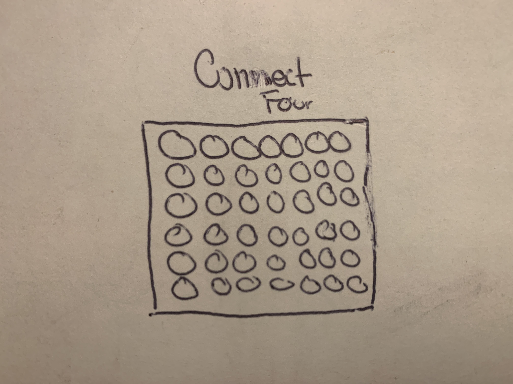

# ConnectFour

Connect Four goes by many names such as Four up, Plot Four, Four in a Row, Four in a LIne, Drop Four, and even Gravitrips.

Though it's exact origin is not known, the game title "Connect Four" was coined in 1974 by Milton Bradley Company even though it has been played for many years prior.

Technologies used includes HTML, CSS, and Javascript. 

Link to game

https://hjamienordstrom.github.io/indianajones/

How to play
    1) Each player is to 'drop' a game piece into the slot of the game board. 
    2) Each player only recieves one turn before switching to the other player. 
    3) The goal is to connect four pieces in a row before your opponent does, you may use pieces to block them. 

Next Steps
    1) Create an AI for the player to play against. 
    2) Include the effect of 'gravity', meaning no free floating pieces, they can only be stacked.